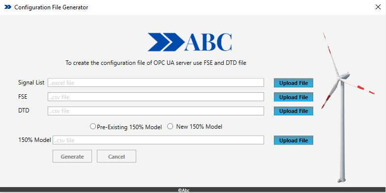
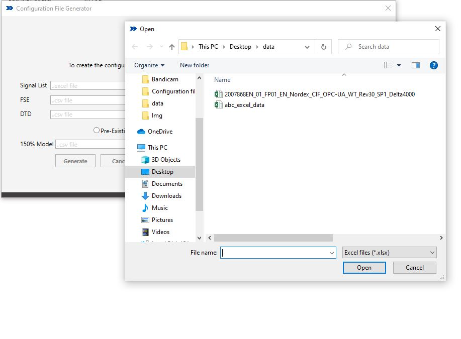
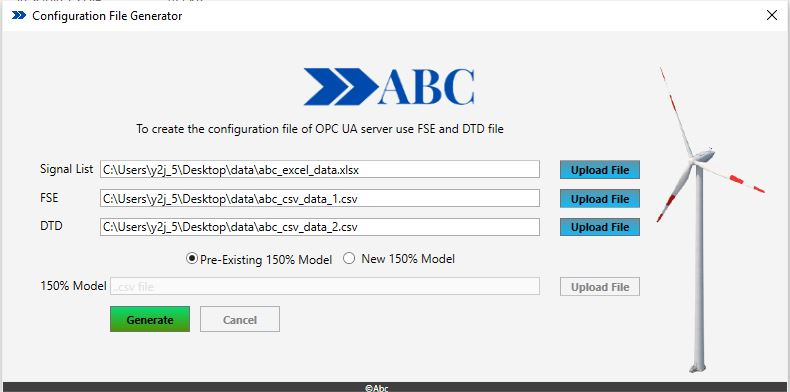
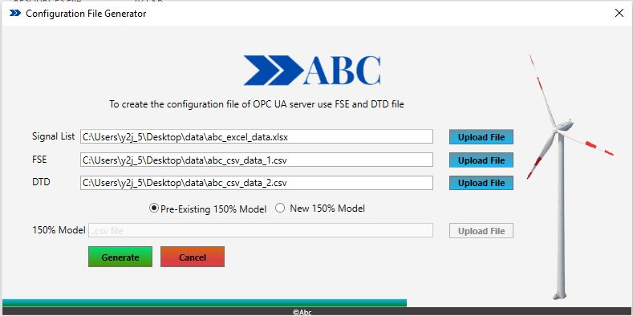
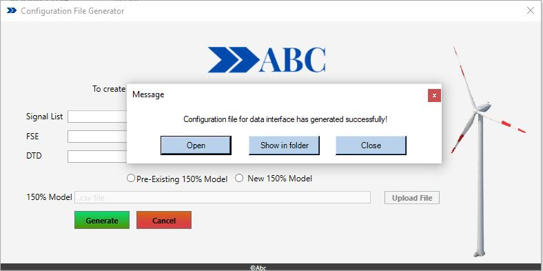

# Frontend-Sample-Desktop-Application
 this example include minimalistic design of frontend for desktop application
 

Main purpose is to come up with new minimalistic GUI design along check box disbale feature and new gradient progress bar look

## Images of GUI

## Main Screen

##

## After starting the application it will let to the choose file 
selecting file is limited by filter so only specific required file type will be show.

##

## Check box is shown and will disbale the next field if pre-exisiting file is ticked

##

## Upto clicking of generate progress bar will start showing the execution progress

##

## Once the execution completed successful message will appear along aside providing the option to open or show in floder or close.

